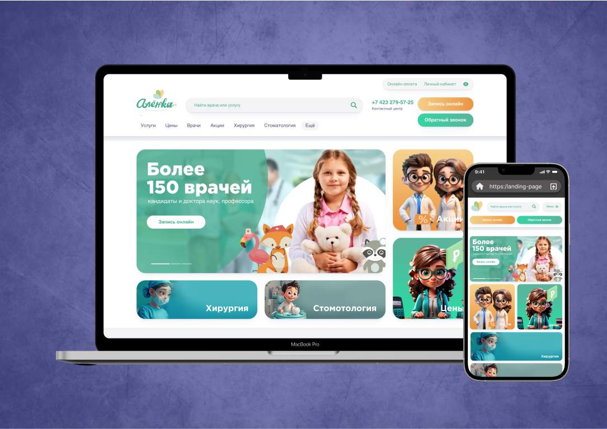

# Alenka Medical Center Website
The Alenka Medical Center website represents a multi-disciplinary healthcare network in Vladivostok, dedicated to providing top-quality medical services for families, with a special focus on children's health. Our clinics offer a wide range of medical specialties, including pediatrics, neurology, pediatric dentistry, surgery, ophthalmology, and more, all delivered by a team of professional and caring specialists.

➼ Technology Stack:
- HTML5 for structure
- CSS3 for styling
- SCSS/Sass for advanced styling and better maintainability
- JavaScript for dynamic functionality
- Gulp for task automation
- Flexbox & Grid for responsive design
- BEM methodology for clean, scalable code

This tech stack ensures a seamless user experience across all devices, providing an intuitive interface with practical elements such as online consultation bookings and informative sections about the clinic’s services and medical team.
